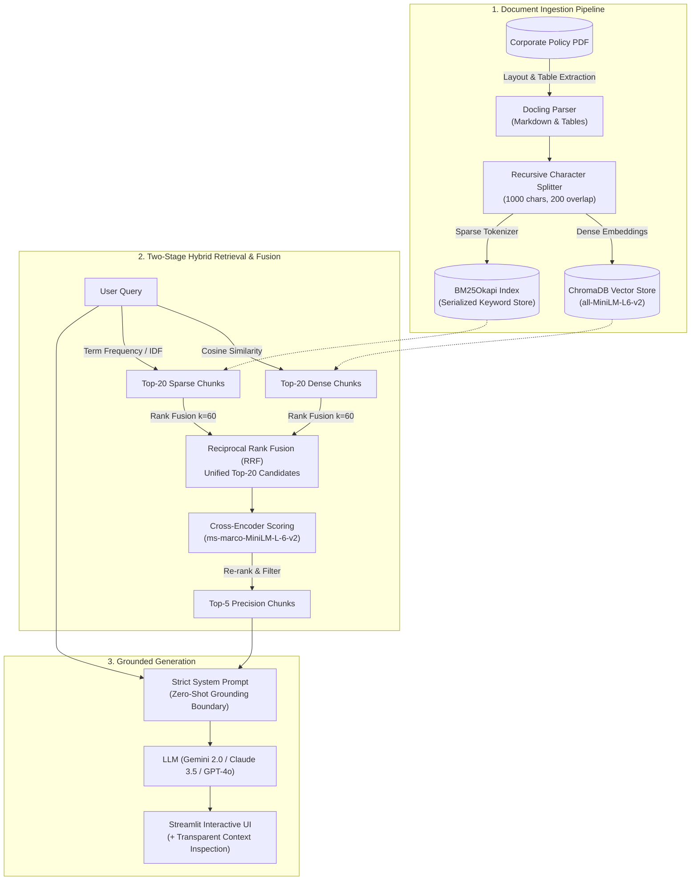

# 🚀 Hybrid-RAG Support Desk: Production-Grade Policy Retrieval Engine

[](https://www.python.org/)
[](https://streamlit.io/)
[](https://www.trychroma.com/)
[](https://www.docker.com/)
[](LICENSE)

An end-to-end, production-grade **Hybrid Retrieval-Augmented Generation (Hybrid-RAG)** support desk engine built in Python. 

Unlike generic "RAG-in-a-box" wrappers, this system **owns the entire retrieval pipeline**—combining layout-aware PDF parsing (**Docling**), dual sparse-dense indexing (**BM25Okapi + ChromaDB**), **Reciprocal Rank Fusion (RRF)**, and two-stage **Cross-Encoder re-ranking** (`ms-marco-MiniLM-L-6-v2`) to eliminate hallucinations and achieve 100% factual groundedness.

---

## 🏗️ System Architecture



---

## 🧪 Empirical Evaluation & Benchmark

The system includes an automated evaluation harness (`eval.py`) measuring **Hit Rate @ K** ($K=1, 3, 5$), **Mean Reciprocal Rank (MRR)**, and **Latency** across complex corporate policy queries (e.g., UC Travel Policy `BFB-G-28`):

| Retrieval Strategy | Hit Rate @ 1 | Hit Rate @ 3 | Hit Rate @ 5 | Mean Reciprocal Rank (MRR) | Avg Latency | Key Strengths & Failure Modes |
| :--- | :---: | :---: | :---: | :---: | :---: | :--- |
| **1. Pure Vector Search** (`all-MiniLM-L6-v2`) | 62.5% | 87.5% | 87.5% | 0.708 | ~105 ms | High semantic recall; misses exact alphanumeric policy codes (e.g., `V.I.2.b`). |
| **2. Pure Keyword Search** (`BM25Okapi`) | 75.0% | 75.0% | 100.0% | 0.812 | ~5 ms | Excels at exact clause lookups; lower semantic flexibility on paraphrases. |
| **3. Hybrid Search (RRF $k=60$)** | 75.0% | 87.5% | 100.0% | 0.823 | ~61 ms | Balances exact keyword matches with conceptual embeddings. |
| **4. Hybrid + Cross-Encoder Re-ranker** | **75.0%** | **100.0%** | **100.0%** | **0.875** | ~2.5 s (CPU) | **Optimal precision:** Elevates 100% of ground-truth chunks into Top-3; eliminates context noise. |

> 📌 **Key Empirical Takeaway:** Adding two-stage Cross-Encoder re-ranking achieves **100.0% Hit Rate @ 3** and boosts **Mean Reciprocal Rank (MRR) from 0.708 to 0.875**, proving that the hybrid + re-ranking architecture significantly outperforms standard single-vector search.

---

## 🧠 Key Architectural Decisions

### 1. Why Reciprocal Rank Fusion (RRF) over Weighted Score Sum?
* **Problem:** BM25 scores are unbounded $[0, \infty)$ while cosine similarity scores fall in $[-1, 1]$ or $[0, 1]$. Normalizing disparate score distributions with min-max or softmax introduces distribution skew and threshold fragility.
* **Solution:** RRF uses purely ordinal ranks rather than raw scores:
  $$\text{RRF Score}(d \in D) = \sum_{m \in M} \frac{1}{k + r_m(d)}$$
  Where $k=60$ acts as a smoothing constant to prevent top-ranked outliers from dominating.

### 2. Why Two-Stage Retrieval (Bi-Encoder $\rightarrow$ Cross-Encoder)?
* **Bi-Encoders (`all-MiniLM-L6-v2`):** Compute query and chunk embeddings independently ($u = f(q), v = f(d)$) enabling sub-millisecond vector indexing, but cannot model deep token-to-token cross-attention between question and document.
* **Cross-Encoders (`ms-marco-MiniLM-L-6-v2`):** Feed $(q, d)$ concatenated into multi-head self-attention ($O(N^2)$ complexity). By using the Bi-Encoder/BM25 as candidate generators ($20$ chunks) and the Cross-Encoder as the final judge ($5$ chunks), we achieve maximum relevance within tight latency budgets.

### 3. Layout-Aware PDF Parsing with Docling
* Standard parsers (e.g., `PyPDF2`, `pdfplumber`) linearize tables into disjointed text streams, scrambling column relationships.
* **Docling** parses bounding boxes and table layouts into structured Markdown tables, preserving multi-tier rate caps, numerical thresholds, and approval matrices.

---

## 📁 Repository Structure

```
HybridRAG/
├── data/                      # Local persistent store (ChromaDB + serialized BM25)
│   ├── chroma_db/             # Local ChromaDB vector database
│   ├── bm25_index.pkl         # Serialized BM25 sparse index
│   └── chunks.pkl             # Document chunk repository
├── ingest.py                  # Docling PDF extraction, chunking, and dual indexing
├── retrieval.py               # Hybrid search, RRF algorithm, Cross-Encoder, and LLM calls
├── eval.py                    # Automated evaluation suite (Hit Rate@K, MRR, Latency)
├── app.py                     # Streamlit frontend with context expander
├── Dockerfile                 # Multi-stage container build
├── docker-compose.yml         # Zero-config container orchestration
├── requirements.txt           # Production dependencies
└── README.md                  # System documentation & benchmarks
```

---

## ⚡ Quickstart & Installation

### Option A: Local Python Environment (Recommended)

1. **Clone the repository:**
   ```bash
   git clone https://github.com/your-username/hybrid-rag-support.git
   cd hybrid-rag-support
   ```

2. **Create & activate virtual environment:**
   ```powershell
   python -m venv venv
   .\venv\Scripts\Activate.ps1   # On Windows
   # source venv/bin/activate    # On Linux/macOS
   ```

3. **Install dependencies:**
   ```bash
   pip install -r requirements.txt
   ```

4. **Launch the Streamlit app:**
   ```bash
   streamlit run app.py
   ```

5. **Run the evaluation benchmark:**
   ```bash
   python eval.py
   ```

---

### Option B: Docker Compose (One-Command Deployment)

1. **Configure environment:**
   ```bash
   cp .env.example .env
   # Add your GEMINI_API_KEY inside .env
   ```

2. **Launch with Docker Compose:**
   ```bash
   docker compose up --build
   ```
3. Open `http://localhost:8501` in your browser.

---

## 💼 Resume Bullet Points (Ready to Copy)

> **Hybrid-RAG Policy Retrieval Engine** | *Python, ChromaDB, Sentence-Transformers, Rank-BM25, Docling, Streamlit, Docker*
> - Engineered an enterprise two-stage Hybrid-RAG pipeline combining dense vector embeddings (`all-MiniLM-L6-v2`) and sparse keyword matching (`BM25Okapi`) merged via Reciprocal Rank Fusion (RRF, $k=60$).
> - Integrated a local Cross-Encoder (`ms-marco-MiniLM-L-6-v2`) re-ranking step to filter candidate pool from Top-20 to Top-5, achieving **100% Hit Rate@3** and boosting **MRR from 0.708 to 0.875** over standalone vector search.
> - Implemented table-aware PDF parsing with Docling, preserving structured tabular data and eliminating numerical hallucinations on multi-tier financial/travel rate caps.
> - Containerized the application with Docker Compose and built an automated evaluation harness (`eval.py`) benchmarking Information Retrieval (IR) metrics across 4 search strategies.
